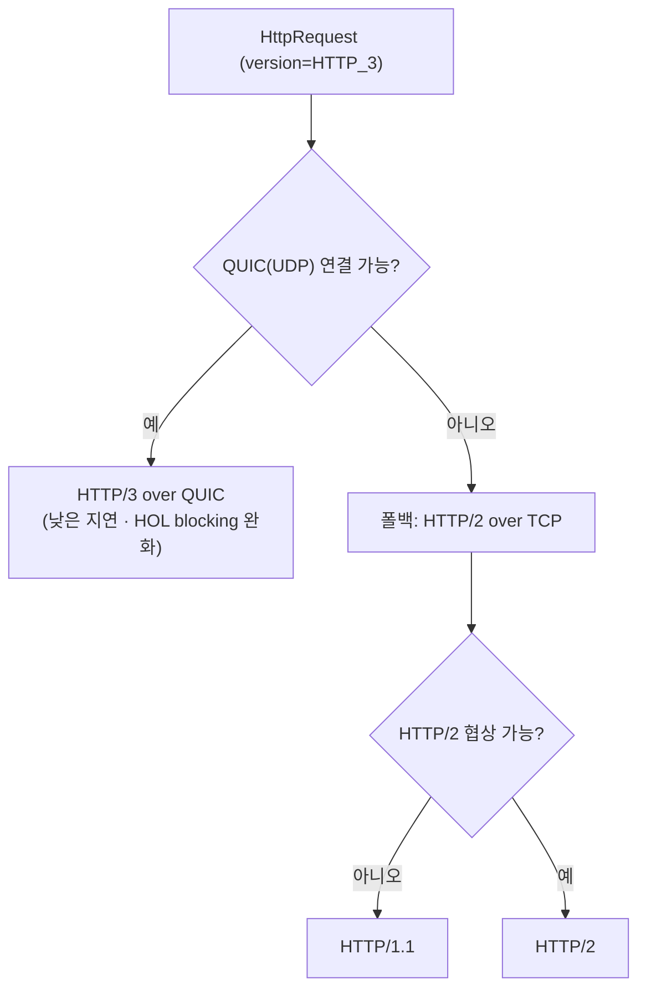

# Java 26 (2026.03) — non-LTS

> Java 25 LTS 직후의 첫 정규(비-LTS) 릴리스. HTTP/3 클라이언트와 모든 GC에 적용되는 AOT 객체 캐싱을 정식화하고, "final은 진짜 final"로 가는 무결성 준비 단계를 시작했다. 구조적 동시성·원시 타입 패턴·지연 상수는 다음 LTS를 향해 프리뷰를 한 단계씩 더 진전시켰다.

## 릴리스 정보
- 정식 출시일: 2026년 3월 17일
- LTS 여부: **아니오** (non-LTS, 6개월 지원). 직전 LTS는 Java 25(2025.09), 다음 LTS는 예정상 Java 29
- 클래스 파일 포맷 버전: 70
- 포함 JEP 목록 (총 10개 — 정식 5 / 프리뷰·인큐베이터 5):
  - JEP 500: Prepare to Make Final Mean Final (정식)
  - JEP 504: Remove the Applet API (정식)
  - JEP 516: Ahead-of-Time Object Caching with Any GC (정식)
  - JEP 517: HTTP/3 for the HTTP Client API (정식)
  - JEP 522: G1 GC 처리량 개선 — 동기화 비용 축소 (정식)
  - JEP 524: PEM Encodings of Cryptographic Objects (2차 프리뷰)
  - JEP 525: Structured Concurrency (6차 프리뷰)
  - JEP 526: Lazy Constants (2차 프리뷰)
  - JEP 529: Vector API (11차 인큐베이터)
  - JEP 530: Primitive Types in Patterns, instanceof, and switch (4차 프리뷰)

## 시대적 배경

Java 26은 Java 25 LTS가 차세대 기능들을 정식화해 모은 직후, 6개월 케이던스의 정규 비-LTS 릴리스로 도착했다. LTS가 "결실을 안정화해 모으는" 릴리스라면, 그 다음 비-LTS는 "다음 LTS(Java 29)를 향해 프리뷰를 한 단계씩 더 다듬고, 준비된 기능은 바로 정식화하는" 성격이 강하다. 실제로 26에서는 신규 기능인 HTTP/3과 G1 개선이 곧장 정식으로 들어왔고, **Project Leyden**의 AOT 객체 캐싱이 모든 GC로 확장되어 정식화된 반면, **Project Loom**(구조적 동시성)·**Project Amber**(원시 타입 패턴)·지연 상수·PEM·Vector API는 프리뷰/인큐베이터 단계를 한 차수씩 더 올렸다. 또한 오래 사장돼 있던 **Applet API가 완전히 제거**되고, 향후 "final은 진짜 final"을 강제하기 위한 **무결성(integrity by default)** 준비가 시작됐다.

## 주요 추가 기능

### HTTP/3 for the HTTP Client API (JEP 517, 정식)
- `java.net.http.HttpClient`가 HTTP/3을 지원한다. HTTP/3은 TCP가 아니라 **QUIC(UDP 기반)** 위에서 동작해 연결 수립 지연과 head-of-line blocking을 줄인다. 기본 협상 버전은 여전히 HTTP/2이며, HTTP/3은 명시적으로 선택한다.

```java
// 클라이언트 레벨에서 HTTP/3 선택
HttpClient client = HttpClient.newBuilder()
        .version(HttpClient.Version.HTTP_3)
        .build();

// 요청 레벨에서만 지정 — 실패 시 HTTP/2·1.1로 폴백 가능
HttpRequest request = HttpRequest.newBuilder()
        .version(HttpClient.Version.HTTP_3)
        .uri(URI.create("https://example.com"))
        .GET()
        .build();
```

아래 흐름도는 HTTP/3 요청의 협상·폴백 경로를 보여준다. 요청에만 HTTP/3을 지정하면 QUIC 연결을 시도하고, 실패하면 기존 TCP 기반 HTTP/2(또는 1.1)로 자연스럽게 내려간다.



### Ahead-of-Time Object Caching with Any GC (JEP 516, 정식)
- Project Leyden의 AOT 캐시가 특정 GC(이전엔 비-세대형 전제)에 묶이지 않고 **모든 GC(ZGC 포함)에서 동작**하도록 객체 캐싱을 일반화했다. 캐시된 힙 객체를 GC 중립적인 포맷으로 순차 로딩해, 시작·워밍업 시간을 단축한다. Java 25의 AOT 작업(JEP 514·515)을 GC 선택과 무관하게 쓸 수 있게 넓힌 후속이다.

### Prepare to Make Final Mean Final (JEP 500, 정식)
- deep reflection으로 `final` 필드를 변경(mutate)하려 하면 **런타임 경고**를 발생시킨다. 향후 릴리스에서는 기본적으로 예외를 던질 예정으로, "integrity by default"(무결성 기본화)를 향한 준비 단계다. 직렬화 프레임워크·테스트 도구 등이 final 필드를 우회 수정하던 관행을 점진적으로 막는다.

### Lazy Constants (JEP 526, 2차 프리뷰)
- Java 25의 **Stable Values(JEP 502, 1차 프리뷰)**가 `Lazy Constants`로 개명·진전했다. `final`의 불변성과 지연 초기화의 유연성을 결합한 "단 한 번만 설정되는" 컨테이너로, 내부적으로 JVM의 `@Stable` 의미론에 저장돼 JIT가 상수처럼 최적화한다.

```java
// 지연 초기화 싱글턴 (Holder 패턴 대체)
static final LazyConstant<ExpensiveObject> INSTANCE = LazyConstant.of(ExpensiveObject::new);

ExpensiveObject get() {
    return INSTANCE.get();   // 최초 접근 시 1회 초기화, 이후 상수처럼 취급
}
```
프리뷰 기능이므로 `--enable-preview`가 필요하다.

### Primitive Types in Patterns, instanceof, and switch (JEP 530, 4차 프리뷰)
- 원시 타입을 패턴 매칭·`instanceof`·`switch`에서 쓸 수 있다. 핵심 개념은 **exactness(정확 변환)** — 손실 없는 변환일 때만 바인딩되어 컴파일 타임 안전성을 준다. Java 25에서 3차 프리뷰(JEP 507)였던 것이 26에서 4차 프리뷰로 진전했다.

```java
// 손실 없이 byte 범위에 들어갈 때만 바인딩
if (x instanceof byte b) {
    handleByte(b);
}

switch (number) {
    case int i    -> handleInt(i);
    case double d -> handleDouble(d);
    default       -> { }
}
```
프리뷰 기능이므로 `--enable-preview`가 필요하다.

### Structured Concurrency (JEP 525, 6차 프리뷰)
- 구조적 동시성 API가 6차 프리뷰로 계속 다듬어졌다. 이번 차수에서는 `Joiner`에 타임아웃을 거는 방식과 결과 취합 메서드명이 정돈됐다(예: `anySuccessfulResultOrThrow()` → `anySuccessfulOrThrow()`, `allSuccessfulOrThrow()`는 결과 리스트 반환).

```java
Response handle() throws InterruptedException {
    try (var scope = StructuredTaskScope.open()) {
        var user  = scope.fork(() -> findUser());
        var order = scope.fork(() -> fetchOrder());
        scope.join();                 // 자식 모두 대기 (실패 시 함께 취소)
        return new Response(user.get(), order.get());
    }
}
```
프리뷰 기능이므로 `--enable-preview`가 필요하다. (Java 21에서 정식화된 가상 스레드와 달리, 구조적 동시성은 여전히 미정식 상태로 남아 있다.)

## 그 외 변경
- **Remove the Applet API (JEP 504, 정식)**: 브라우저 플러그인 시대의 유물인 `java.applet` API를 완전히 제거했다. 한 시대를 마감하는 정리 작업이다.
- **G1 GC 처리량 개선 (JEP 522, 정식)**: G1 가비지 컬렉터의 내부 동기화 비용을 줄여 처리량을 높였다. 애플리케이션 코드 변경 없이 기본 GC의 성능이 개선된다.
- **PEM Encodings of Cryptographic Objects (JEP 524, 2차 프리뷰)**: 키·인증서 등 암호 객체를 PEM 텍스트로 인코딩/디코딩하는 API가 25의 1차 프리뷰(JEP 470)에 이어 2차 프리뷰로 진전했다.
- **Vector API (JEP 529, 11차 인큐베이터)**: SIMD 벡터 연산 API는 Valhalla 의존성으로 인해 여전히 인큐베이터(11차)에 머문다.

## 영향과 의의

Java 26은 LTS 사이를 잇는 전형적인 비-LTS 릴리스다. 당장 프로덕션 표준으로 채택되기보다, Java 25 LTS 위에서 차기 LTS(Java 29)로 가는 기능들을 검증·정식화하는 자리에 가깝다. 그럼에도 **HTTP/3 클라이언트**와 **모든 GC에 적용되는 AOT 객체 캐싱**처럼 바로 쓸 수 있는 정식 기능이 들어왔고, **"final은 진짜 final"** 무결성 준비와 **Applet API 제거**는 플랫폼의 장기 방향(안전한 기본값·레거시 정리)을 분명히 보여준다. 구조적 동시성·원시 타입 패턴·지연 상수는 아직 프리뷰로 남아, Loom·Amber·Valhalla의 완성은 다음 LTS의 숙제로 이어진다.

## 참고 출처
- [JDK 26 - OpenJDK 프로젝트 페이지](https://openjdk.org/projects/jdk/26/)
- [JDK 26 - jdk.java.net](https://jdk.java.net/26/)
- [The Arrival of Java 26 - Oracle Java Blog](https://blogs.oracle.com/java/the-arrival-of-java-26)
- [Java 26 Delivers... - InfoQ](https://www.infoq.com/news/2026/03/java26-released/)
- [JEP 517: HTTP/3 for the HTTP Client API](https://openjdk.org/jeps/517)
- [JEP 526: Lazy Constants](https://openjdk.org/jeps/526)
- [JEP 525: Structured Concurrency (Sixth Preview)](https://openjdk.org/jeps/525)
- [JEP 530: Primitive Types in Patterns, instanceof, and switch (Fourth Preview)](https://openjdk.org/jeps/530)
- [JEP 500: Prepare to Make Final Mean Final](https://openjdk.org/jeps/500)
- [Java version history - Wikipedia](https://en.wikipedia.org/wiki/Java_version_history)
