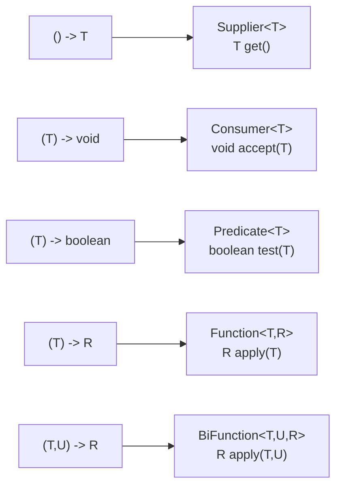
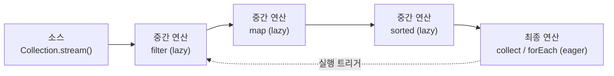

# Java SE 8 (2014년 3월)

> 람다 표현식과 Stream API로 자바에 함수형 프로그래밍을 도입한, 자바 역사상 가장 혁명적인 릴리스.

## 릴리스 정보
- 정식 출시일: 2014년 3월 18일 (JDK 8 General Availability)
- 개발 주체: Oracle (OpenJDK / JCP)
- 플랫폼 명세: JSR 337 (Java SE 8 Platform)
- 코드네임: 별도의 공식 마케팅 코드네임 없음 (개발 프로젝트명은 "JDK 8")
- LTS 여부: 현대적 LTS 모델(Java 11부터 시작) 이전 버전이지만, Oracle이 상용·확장 지원을 장기간 제공하여 사실상 가장 오래 살아남은 "장기 지원" 버전으로 취급됨

## 시대적 배경

Java 8은 자바 진영이 함수형 프로그래밍이라는 시대적 흐름에 응답한 결과물이다. 2000년대 후반부터 Scala, Clojure, Groovy 같은 JVM 기반 언어들이 함수형 스타일과 간결한 문법을 무기로 자바의 장황함(verbosity)을 정면으로 비판했다. 익명 클래스로 콜백 하나를 넘기는 데 5~6줄을 써야 하는 자바의 boilerplate는 멀티코어 시대의 병렬 처리 요구와도 맞지 않았다.

원래 람다(Project Lambda, JSR 335)는 Java 7에 포함될 예정이었으나, Sun의 경영난과 Oracle의 인수(2010) 과정에서 "Plan B"에 따라 Java 7에서는 작은 기능들만 내고 람다와 모듈 시스템은 다음 버전으로 미뤄졌다. 그 결과 람다는 Java 8로, 모듈 시스템은 Java 9로 넘어갔다. 약 2년 반의 준비 끝에 출시된 Java 8은 언어·라이브러리·JVM 전반을 동시에 바꾼 대형 릴리스가 되었다.

## 주요 추가 기능

### 람다 표현식 (JSR 335, JEP 126)
- 함수를 값처럼 전달할 수 있게 하는 익명 함수 문법. 자바 8의 핵심이자 다른 모든 기능의 토대다.
- 동작 파라미터화(behavior parameterization)를 가능하게 하여, 익명 클래스의 장황함을 제거했다.

```java
// Before (Java 7): 익명 클래스로 Runnable 전달
Runnable r = new Runnable() {
    @Override
    public void run() {
        System.out.println("Hello");
    }
};
new Thread(r).start();

// 정렬도 익명 Comparator로
List<String> names = Arrays.asList("Charlie", "Alice", "Bob");
Collections.sort(names, new Comparator<String>() {
    @Override
    public int compare(String a, String b) {
        return a.compareTo(b);
    }
});
```

```java
// After (Java 8): 람다로 간결하게
Runnable r = () -> System.out.println("Hello");
new Thread(r).start();

List<String> names = Arrays.asList("Charlie", "Alice", "Bob");
Collections.sort(names, (a, b) -> a.compareTo(b));
// 또는 메서드 참조 + Comparator 유틸
names.sort(Comparator.naturalOrder());
```

### 함수형 인터페이스와 java.util.function
- 추상 메서드가 정확히 하나인 인터페이스(SAM, Single Abstract Method)를 함수형 인터페이스라 하며, 람다의 타깃 타입이 된다.
- `@FunctionalInterface` 어노테이션으로 의도를 명시하고 컴파일러 검증을 받는다.
- 표준 함수형 인터페이스 패키지 `java.util.function` 도입: `Function<T,R>`, `Supplier<T>`, `Consumer<T>`, `Predicate<T>`, `BiFunction<T,U,R>`, `UnaryOperator<T>` 등.

```java
@FunctionalInterface
interface Calculator {
    int apply(int a, int b);
}

Calculator add = (a, b) -> a + b;
System.out.println(add.apply(3, 4)); // 7

Predicate<String> isEmpty = String::isEmpty;
Function<String, Integer> length = String::length;
```

하나의 람다는 추상 메서드가 하나뿐인 함수형 인터페이스(SAM)의 인스턴스로 변환된다. 아래는 대표 인터페이스와 람다 형태의 매핑이다.



람다의 파라미터·반환 형태가 타깃 함수형 인터페이스의 단일 추상 메서드 시그니처와 일치할 때, 그 인터페이스 타입으로 추론된다.

### 메서드 참조 (Method References)
- 이미 존재하는 메서드를 람다 대신 가리키는 축약 문법. `::` 연산자 사용.
- 4가지 형태: 정적 메서드(`ClassName::staticMethod`), 특정 객체의 인스턴스 메서드(`instance::method`), 임의 객체의 인스턴스 메서드(`ClassName::instanceMethod`), 생성자(`ClassName::new`).

```java
// 람다 → 메서드 참조
list.forEach(s -> System.out.println(s));
list.forEach(System.out::println);          // 인스턴스 메서드 참조

names.stream().map(s -> s.toUpperCase());
names.stream().map(String::toUpperCase);    // 임의 객체 인스턴스 메서드

Supplier<ArrayList<String>> factory = ArrayList::new; // 생성자 참조
```

### Stream API (JEP 107)
- `java.util.stream` 패키지. 컬렉션에 대해 함수형 스타일(filter / map / reduce)의 선언적 연산을 제공한다.
- 중간 연산(intermediate, lazy: `filter`, `map`, `sorted`, `distinct`)과 최종 연산(terminal: `collect`, `forEach`, `reduce`, `count`)으로 구성된 파이프라인.
- `parallelStream()`으로 손쉬운 병렬 처리. 멀티코어 활용을 데이터 구조 수준에서 추상화했다.

```java
// Before (Java 7): 명령형 루프
List<String> names = Arrays.asList("Charlie", "Alice", "Bob", "alex");
List<String> result = new ArrayList<>();
for (String name : names) {
    if (name.length() > 3) {
        result.add(name.toUpperCase());
    }
}
Collections.sort(result);
```

```java
// After (Java 8): 선언적 스트림 파이프라인
List<String> result = names.stream()
        .filter(name -> name.length() > 3)
        .map(String::toUpperCase)
        .sorted()
        .collect(Collectors.toList());

// 집계와 그룹핑도 한 줄로
Map<Integer, List<String>> byLength = names.stream()
        .collect(Collectors.groupingBy(String::length));

int totalLength = names.stream().mapToInt(String::length).sum();

// 병렬 처리
long count = names.parallelStream().filter(n -> n.length() > 3).count();
```

Stream은 소스 → 중간 연산 → 최종 연산으로 이어지는 파이프라인이며, 중간 연산은 **지연(lazy)** 평가된다.



`collect`·`forEach` 같은 최종 연산이 호출되기 전까지는 중간 연산이 실제로 실행되지 않는다(지연 평가). 최종 연산이 파이프라인 전체를 한 번에 흐르게 한다.

### 인터페이스의 default 메서드와 static 메서드 (JSR 335)
- 인터페이스에 구현(body)을 가진 `default` 메서드와 `static` 메서드를 추가할 수 있게 됨.
- 기존 인터페이스(`Collection`, `List` 등)에 `forEach`, `stream`, `removeIf` 같은 새 메서드를 기존 구현체를 깨뜨리지 않고 추가하기 위한 "인터페이스 진화(interface evolution)" 메커니즘. Stream API 도입의 전제 조건이기도 했다.

```java
interface Vehicle {
    void start();

    // default 메서드: 구현체가 오버라이드하지 않아도 됨
    default void honk() {
        System.out.println("Beep!");
    }

    // static 메서드
    static Vehicle create() {
        return () -> System.out.println("started");
    }
}
```

### 새 날짜·시간 API: java.time (JSR 310, JEP 150)
- 기존 `java.util.Date`/`Calendar`의 고질적 문제(가변성, 0부터 시작하는 month, 스레드 안전성 부재, 빈약한 API)를 해결한 불변(immutable)·스레드 안전 API.
- Joda-Time에서 영감을 받았으며, 핵심 타입: `LocalDate`, `LocalTime`, `LocalDateTime`, `ZonedDateTime`, `Instant`, `Duration`, `Period`, `DateTimeFormatter`.

```java
// Before (Java 7): Date/Calendar - 가변, month는 0부터
Calendar cal = Calendar.getInstance();
cal.set(2014, Calendar.MARCH, 18); // 2(=March)... 헷갈림
Date date = cal.getTime();
SimpleDateFormat sdf = new SimpleDateFormat("yyyy-MM-dd"); // 스레드 안전하지 않음
String s = sdf.format(date);
```

```java
// After (Java 8): java.time - 불변, 직관적
LocalDate date = LocalDate.of(2014, 3, 18);  // month 그대로 3
LocalDate nextWeek = date.plusWeeks(1);       // 새 객체 반환 (불변)
String s = date.format(DateTimeFormatter.ISO_LOCAL_DATE);

LocalDateTime now = LocalDateTime.now();
Duration d = Duration.between(now, now.plusHours(2)); // PT2H
ZonedDateTime seoul = ZonedDateTime.now(ZoneId.of("Asia/Seoul"));
```

### Optional<T> (별도 JEP 아님, JSR 335 / Java SE 8 라이브러리 API, java.util.Optional @since 1.8)
- 값이 있을 수도/없을 수도 있음을 타입으로 표현하여 `NullPointerException`을 줄이고 의도를 명시하는 컨테이너.
- `map`, `filter`, `flatMap`, `orElse`, `orElseGet`, `orElseThrow`, `ifPresent`로 함수형 처리.

```java
// Before (Java 7): 수동 null 체크
public String getCityName(User user) {
    if (user != null) {
        Address addr = user.getAddress();
        if (addr != null) {
            City city = addr.getCity();
            if (city != null) {
                return city.getName();
            }
        }
    }
    return "Unknown";
}
```

```java
// After (Java 8): Optional 체이닝
public String getCityName(User user) {
    return Optional.ofNullable(user)
            .map(User::getAddress)
            .map(Address::getCity)
            .map(City::getName)
            .orElse("Unknown");
}
```

### Nashorn JavaScript 엔진 (JEP 174)
- 기존 Rhino 엔진을 대체하는 고성능 JavaScript 런타임. `invokedynamic` 기반으로 JVM 위에서 ECMAScript를 실행.
- 명령행 도구 `jjs` 제공, `javax.script` API를 통해 자바와 상호 운용. (이후 Java 11에서 deprecated, Java 15에서 제거됨.)

### PermGen 제거 → Metaspace (JEP 122)
- 클래스 메타데이터를 보관하던 힙 내부 영역 PermGen(Permanent Generation)을 완전히 제거.
- 클래스 메타데이터를 네이티브 메모리 영역인 **Metaspace**로 이동. 크기를 튜닝하기 어렵고 `OutOfMemoryError: PermGen space`를 자주 유발하던 문제를 완화했고, 기본적으로 가용 네이티브 메모리까지 자동 확장(`-XX:MaxMetaspaceSize`로 상한 지정 가능).

### 타입 어노테이션 (JSR 308, JEP 104)
- 어노테이션을 선언 위치뿐 아니라 타입이 사용되는 모든 곳(제네릭 타입 인자, 캐스트, `throws`, `new` 등)에 붙일 수 있게 확장.
- `ElementType.TYPE_USE`, `TYPE_PARAMETER` 추가. Checker Framework 같은 정적 분석 도구의 토대가 되었다.

```java
List<@NonNull String> strings;        // 제네릭 타입 인자에 어노테이션
@Readonly Document doc = ...;
String s = (@NonNull String) obj;     // 캐스트에 어노테이션
```

### CompletableFuture (java.util.concurrent)
- 기존 `Future`의 한계(블로킹 `get()`, 조합 불가)를 극복한 비동기 프로그래밍 API.
- 콜백 체이닝(`thenApply`, `thenAccept`, `thenCompose`), 조합(`thenCombine`, `allOf`, `anyOf`), 예외 처리(`exceptionally`, `handle`)를 선언적으로 표현.

```java
CompletableFuture.supplyAsync(() -> fetchUser(id))
        .thenApply(User::getName)
        .thenAccept(System.out::println)
        .exceptionally(ex -> { ex.printStackTrace(); return null; });
```

## 그 외 변경 / API 추가
- **Collectors / Collections 강화**: `Collectors.groupingBy`, `partitioningBy`, `joining`, `toMap`; `Map.getOrDefault`, `computeIfAbsent`, `merge`, `forEach`; `Iterable.forEach`, `Collection.removeIf`.
- **Compact Profiles (JEP 161)**: `compact1/2/3` 프로파일로 임베디드 환경용 축소 런타임 제공.
- **StringJoiner / String.join**: 구분자 기반 문자열 결합.
- **Arrays.parallelSort**: 병렬 정렬.
- **Base64**: 표준 `java.util.Base64` 인코더/디코더 추가.
- **Concurrent 개선**: `ConcurrentHashMap` 재설계, `LongAdder`, `StampedLock`.
- **JVM/도구**: `jdeps` 의존성 분석 도구 추가, `invokedynamic` 활용 확대.

## 영향과 의의

Java 8은 "현대 자바의 시작점"으로 평가된다. 람다와 Stream API는 자바 코드의 작성 방식 자체를 명령형에서 선언형·함수형으로 이동시켰고, 동작 파라미터화·지연 평가·병렬화 같은 개념을 주류 엔터프라이즈 개발에 정착시켰다. `java.time`은 날짜/시간 처리의 사실상 표준이 되었고, `Optional`은 null 안전성 문화를 확산시켰다.

엔터프라이즈 생태계에서 Java 8은 가장 광범위하고 오래 사용된 버전이 되었다. 안정성과 풍부한 지원, 그리고 이후 도입된 모듈 시스템(Java 9)으로의 마이그레이션 부담 때문에, 수많은 조직이 오랫동안 Java 8에 머물렀다. 이 "Java 8 고착" 현상은 역설적으로 이 릴리스의 완성도와 영향력을 방증한다. Spring, Hadoop, Android(일부) 등 거의 모든 주요 프레임워크가 람다·스트림을 전제로 API를 재설계하면서, Java 8은 자바 역사의 분기점으로 남았다.

## 참고 출처
- [JSR 337: Java SE 8 (JCP)](https://jcp.org/en/jsr/detail?id=337)
- [JSR 337 Specification (OpenJDK)](https://cr.openjdk.org/~mr/se/8/java-se-8-pr-spec/)
- [JDK 8 Project (OpenJDK)](https://openjdk.org/projects/jdk8/)
- [Java SE 8 is Now Available (Oracle Blog)](https://blogs.oracle.com/java/post/java-se-8-is-now-available)
- [Java 8 Arrives (ADTmag, 2014-03-18)](https://adtmag.com/articles/2014/03/18/java-8-arrives.aspx)
- [Where Has the Java PermGen Gone? (InfoQ)](https://www.infoq.com/articles/Java-PERMGEN-Removed/)
- [JSR 308: Annotations on Java Types (JCP)](https://jcp.org/en/jsr/detail?id=308)
- [Java version history (Wikipedia)](https://en.wikipedia.org/wiki/Java_version_history)
