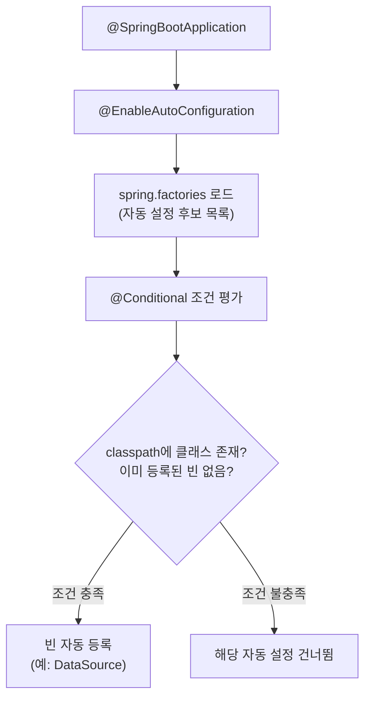
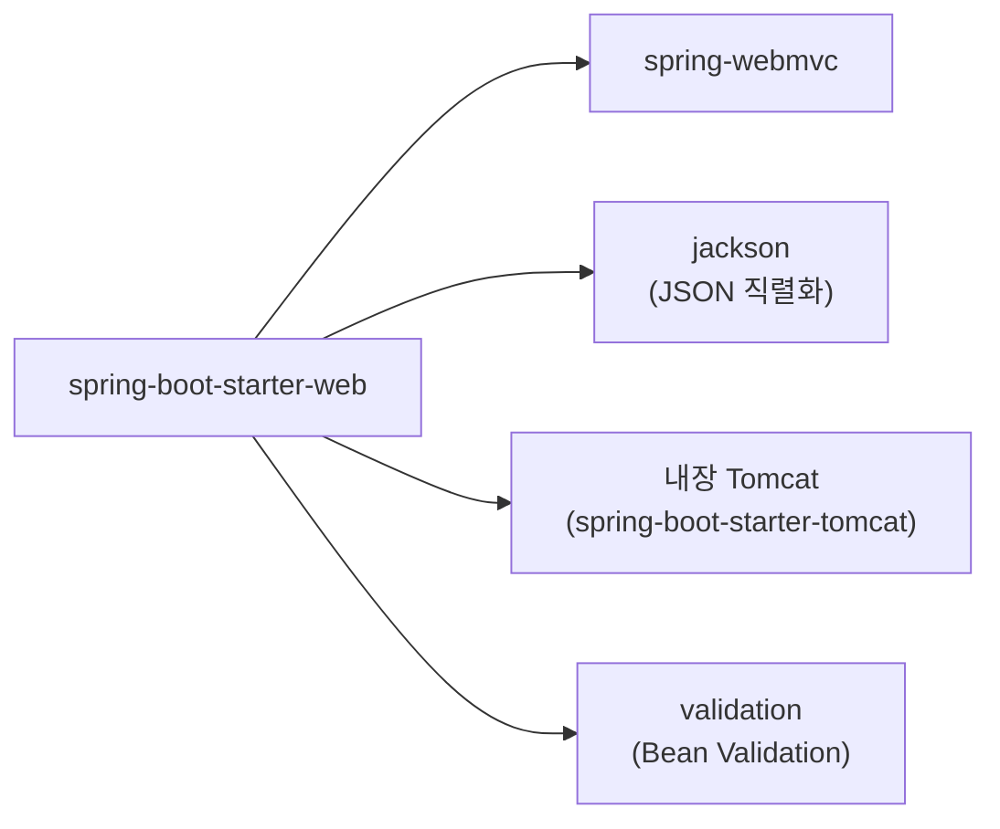

# Spring Boot 1.x (2014 ~)

> 설정 지옥에 빠진 Spring을 "관례 우선(convention over configuration)"으로 구출한 최초의 Spring Boot. `java -jar` 한 줄로 웹 애플리케이션이 뜨는 시대를 열었다.

## 릴리스 정보
- **최초 출시**: Spring Boot 1.0 GA — 2014년 4월 1일
- **주요 마이너 버전과 시기**:
  - 1.0 (2014-04) — 최초 GA
  - 1.1 (2014-06)
  - 1.2 (2014-12) — `@SpringBootApplication` 단축 애너테이션 도입
  - 1.3 (2015-11) — Developer Tools(devtools), 완전한 캐싱 자동 설정
  - 1.4 (2016-07) — 테스트 슬라이스(`@WebMvcTest`, `@DataJpaTest` 등), `@SpringBootTest` 재정비
  - 1.5 (2017-01) — 1.x 마지막 피처 라인, Actuator/Kafka 등 보강
- **기반 Spring Framework 버전**: Spring Framework 4.x (1.0은 4.0, 1.5는 4.3)
- **최소 자바 버전**: 초기 1.x(1.0~1.2)는 Java 6, 1.3부터는 Java 7이 기본 (Java 6은 추가 설정으로만 호환, 서블릿 3.0+ 컨테이너 필요)

## 시대적 배경 (왜 Boot가 등장했나 — Spring의 설정 복잡성 문제)

2000년대 후반~2010년대 초반의 Spring은 강력했지만 시작 비용이 컸다. 전형적인 Spring MVC 프로젝트를 띄우려면:

- `web.xml`에 `DispatcherServlet`, 리스너, 필터를 등록하고
- `applicationContext.xml` / `dispatcher-servlet.xml`에 수십~수백 줄의 빈 정의(데이터소스, 트랜잭션 매니저, 뷰 리졸버, JPA 팩토리 등)를 작성하고
- 의존 라이브러리(Spring, Hibernate, Jackson, 로깅)의 **호환되는 버전 조합**을 손으로 맞추고
- WAR로 패키징해 외부 Tomcat에 배포해야 했다.

애너테이션 기반 설정(`@Configuration`, JavaConfig)이 도입되며 XML은 줄었지만, "무엇을 어떻게 설정해야 하는가"라는 본질적 부담은 그대로였다. 같은 시기 Ruby on Rails, Node.js 등은 "최소 설정으로 바로 실행"을 무기로 빠르게 성장하고 있었다.

Spring 진영의 답이 **Spring Boot**였다. 핵심 철학은 두 가지다.

1. **관례 우선(Convention over Configuration)**: 합리적인 기본값을 제공하고, 필요할 때만 덮어쓴다.
2. **독립 실행형(Standalone)**: 서버를 애플리케이션 안에 내장해 `java -jar`로 실행한다.

Spring Boot는 Spring을 대체하는 것이 아니라, **Spring 위에 얹는 설정 자동화 계층**이다.

## 핵심 기능

### 자동 설정 (Auto-configuration)
클래스패스에 있는 라이브러리와 이미 정의된 빈을 감지해 필요한 빈을 **조건부로(`@Conditional`)** 자동 등록한다. 예를 들어 H2와 Spring JDBC가 클래스패스에 있으면 인메모리 `DataSource`를 자동 구성한다.

```java
@SpringBootApplication // @Configuration + @EnableAutoConfiguration + @ComponentScan (1.2부터)
public class DemoApplication {
    public static void main(String[] args) {
        SpringApplication.run(DemoApplication.class, args);
    }
}
```

자동 설정은 사용자가 직접 정의한 빈이 있으면 물러난다(`@ConditionalOnMissingBean`). 즉, 기본값을 주되 강제하지 않는다.

아래는 "classpath에 있으면 알아서 설정"되는 자동 설정의 동작 흐름이다.



각 자동 설정 후보는 클래스패스와 기존 빈 상태를 조건으로 평가받고, 충족될 때만 빈을 등록한다.

### 스타터 POM (Starter Dependencies)
서로 호환되는 의존성 묶음을 하나의 좌표로 제공한다. 버전 충돌 지옥에서 해방시킨 핵심 장치다.

```xml
<parent>
    <groupId>org.springframework.boot</groupId>
    <artifactId>spring-boot-starter-parent</artifactId>
    <version>1.5.22.RELEASE</version>
</parent>

<dependencies>
    <dependency>
        <groupId>org.springframework.boot</groupId>
        <artifactId>spring-boot-starter-web</artifactId>
    </dependency>
</dependencies>
```

`spring-boot-starter-web` 하나면 Spring MVC, Jackson, 내장 Tomcat, 검증(validation)이 호환 버전으로 한꺼번에 들어온다.

스타터 하나가 끌어오는 전이 의존성 묶음을 그림으로 보면 다음과 같다.



좌표 하나만 선언하면 호환 버전으로 검증된 라이브러리 묶음이 전이 의존성으로 따라온다.

### 내장 서블릿 컨테이너 (Embedded Tomcat/Jetty/Undertow)
별도 WAS 설치/배포 없이 컨테이너를 애플리케이션에 내장한다. 결과물은 모든 의존성을 담은 실행 가능한 "fat jar"다.

```bash
mvn package
java -jar target/demo-1.0.0.jar   # 톰캣 내장, 8080 포트로 즉시 기동
```

기본은 Tomcat이며, 스타터 의존성을 교체해 Jetty나 Undertow로 바꿀 수 있다.

### Actuator (운영 엔드포인트)
프로덕션 운영에 필요한 모니터링/관리 엔드포인트를 자동 제공한다.

```xml
<dependency>
    <groupId>org.springframework.boot</groupId>
    <artifactId>spring-boot-starter-actuator</artifactId>
</dependency>
```

`/health`, `/metrics`, `/info`, `/env`, `/beans`, `/mappings` 등을 통해 애플리케이션 상태를 들여다볼 수 있다. (1.x의 Actuator는 자체 메트릭 모델을 사용했고, 이는 2.0에서 Micrometer로 전면 교체된다.)

### 외부 설정 (Externalized Configuration)
`application.properties` 또는 `application.yml`로 환경별 설정을 코드 밖으로 분리한다. 우선순위(명령행 인자 > 환경변수 > 프로파일별 파일 > 기본 파일)가 정의되어 있다.

```yaml
server:
  port: 8081
spring:
  datasource:
    url: jdbc:mysql://localhost/app
    username: app
  profiles:
    active: dev
```

`@ConfigurationProperties`로 타입 안전한 바인딩도 가능하다.

### Spring Boot CLI
Groovy 스크립트로 프로토타입을 즉석 실행하는 명령행 도구.

```groovy
// app.groovy
@RestController
class Hello {
    @RequestMapping("/")
    String home() { "Hello World!" }
}
```
```bash
spring run app.groovy
```

## 마이너 버전별 변화
- **1.0 (2014)**: 자동 설정, 스타터, 내장 컨테이너, Actuator, CLI 등 핵심 골격 완성.
- **1.2 (2014-12)**: `@SpringBootApplication` 도입(`@Configuration`+`@EnableAutoConfiguration`+`@ComponentScan` 결합), 서블릿 3.1/JTA 지원, 배너 커스터마이징.
- **1.3 (2015)**: `spring-boot-devtools`(자동 재시작/라이브 리로드), 완전한 캐시 자동 설정, fully executable jar.
- **1.4 (2016)**: 테스트 개편 — `@SpringBootTest`, `@WebMvcTest`/`@DataJpaTest` 등 슬라이스 테스트, `@MockBean`. 커스텀 자동 설정 작성 개선.
- **1.5 (2017)**: 1.x의 마지막 라인. Actuator 보안 개선, Kafka 지원, LDAP 자동 설정. 이후 개발 흐름은 2.0으로 이동.

## 영향과 의의
- Spring Boot는 Java 백엔드 개발의 **사실상 표준 시작점**이 되었다. "Spring으로 개발한다"는 말이 곧 "Spring Boot로 개발한다"를 의미하게 만든 출발점이다.
- `web.xml`과 거대한 XML 설정, 외부 WAS 배포라는 무거운 관행을 걷어내고, **마이크로서비스 시대에 맞는 독립 실행형 jar** 패러다임을 정착시켰다.
- 스타터 + 자동 설정 모델은 이후 수많은 프레임워크가 모방한 설계가 되었으며, Spring Cloud 등 상위 생태계의 토대가 되었다.

## 참고 출처
- [Spring Boot 1.0 GA Released (spring.io blog)](https://spring.io/blog/2014/04/01/spring-boot-1-0-ga-released/)
- [Spring Boot 1.4 Release Notes (GitHub wiki)](https://github.com/spring-projects/spring-boot/wiki/Spring-Boot-1.4-Release-Notes)
- [Spring Boot version history (codejava.net)](https://www.codejava.net/frameworks/spring-boot/spring-boot-version-history)
- [Creating Your Own Auto-configuration (Spring docs)](https://docs.spring.io/spring-boot/reference/features/developing-auto-configuration.html)
- [Spring Boot 1.0 — VersionLog](https://versionlog.com/spring-boot/1.0/)
