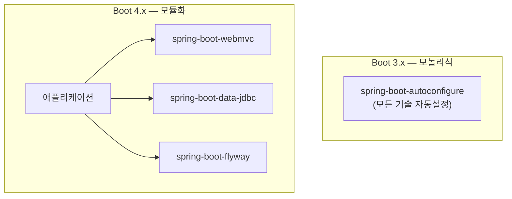

# Spring Boot 4.x (2025 ~)

> Spring Framework 7.0 위에 빌드된 새 세대. **모놀리식 자동 설정 jar의 모듈화**, JSpecify 널 안정성, Jackson 3 기본화, HTTP API 버저닝을 받아들였다. Java 17 baseline을 유지하면서 Java 25를 1급 지원한다.

## 릴리스 정보
- **최초 출시**: Spring Boot 4.0 GA — 2025년 11월 20일 (후속 4.0.1 — 2025년 12월 18일)
- **기반 Spring Framework 버전**: **7.0**
- **최소 자바 버전**: **Java 17** (호환 유지). 최신 LTS **Java 25를 1급(first-class) 지원**
- **Jakarta EE 기준**: **Jakarta EE 11** (Jakarta Servlet 6.1, Jakarta Persistence 3.2)
- **그 외 baseline**: Kotlin 2.2+, 네이티브 이미지는 GraalVM 25+, 빌드는 **Gradle 9 지원**(Gradle 8.x는 8.14+ 유지)

## 시대적 배경 (왜 4.0인가)

Spring Boot 3.x(2022~2025)는 **Jakarta EE 전환(javax→jakarta)·GraalVM 네이티브 이미지·Micrometer 기반 옵저버빌리티**를 골자로 한 세대였다. 4.0은 그 위에서 다음 축으로 넘어간다.

- **코드베이스 모듈화** — 비대해진 단일 자동 설정 jar를 잘게 쪼개 의존성 트리를 슬림화한다.
- **널 안정성 표준화** — Spring Framework 7의 JSpecify를 그대로 받아 포트폴리오 전반에 적용한다.
- **Jackson 3 기본화** — 직렬화 스택의 세대 교체.
- **API 버저닝의 자동 설정 통합** — Framework 7의 버저닝 기능을 프로퍼티로 손쉽게 켠다.
- **최신 플랫폼 정렬** — Jakarta EE 11, Java 25 1급 지원, Gradle 9.

공식 발표 문구대로 "**새로운 Spring Boot 세대의 시작**"이며, Spring Framework 7.0을 토대로 한다.

## 핵심 기능

### 코드베이스 모듈화 (모놀리식 자동 설정 jar의 분리)
2014년 1.0에서 182 KiB이던 `spring-boot-autoconfigure` jar는 3.5에서 약 2 MiB까지 비대해졌다. 4.0은 이 단일 자동 설정 jar를 **기술별 작은 모듈들로 분리**(2차 출처 기준 약 47개)하고, 각 모듈이 자체 스타터를 갖는다. 사용하지 않는 기술의 메타데이터를 싣지 않아 의존성 트리·시작 시간·네이티브 이미지가 개선된다.

```text
# Before (Boot 3.x)
spring-boot-autoconfigure  ──  모든 기술의 자동 설정이 한 jar에

# After (Boot 4.x) — 기술별 모듈 + 스타터로 분리
spring-boot-webmvc / spring-boot-webclient / spring-boot-data-jdbc
spring-boot-flyway / spring-boot-mongodb / ...
```

아래는 분리 구조를 단순화한 그림이다. 애플리케이션은 필요한 기술 모듈만 끌어와 의존성을 슬림하게 유지한다.



점진적 마이그레이션을 위해 **Classic Starter POM**(모듈형 자동 설정을 전이 의존성 없이 묶음)도 제공된다.

### HTTP 엔드포인트 API 버저닝 (자동 설정)
Spring Framework 7의 API 버저닝을 Boot가 자동 설정으로 통합한다. `spring.mvc.apiversion.*` / `spring.webflux.apiversion.*` 프로퍼티로 켜고, 고급 설정은 `ApiVersionResolver`·`ApiVersionParser`·`ApiVersionDeprecationHandler` 빈으로 한다.

```properties
spring.mvc.apiversion.use.header=API-Version
```

```java
@RestController
public class AccountController {
    @GetMapping(path = "/account/{id}", version = "1.1")
    public Account getAccount(@PathVariable Long id) { /* ... */ }
}
```

HTTP Interface Client(`@HttpExchange`)도 버전 속성을 지원하며, Boot가 classpath에 따라 RestClient 또는 WebClient 백엔드로 구현체를 자동 생성한다.

```java
@HttpExchange("/accounts")
public interface AccountService {
    @GetExchange(url = "/{id}", version = "1.1")
    Account getAccount(@PathVariable int id);
}
```

### JSpecify 널 안정성
포트폴리오 전반이 **JSpecify**(`org.jspecify.annotations`)를 채택하고, Spring 자체 `org.springframework.lang` 애노테이션은 deprecated된다. `package-info.java`에 `@NullMarked`를 선언해 기본 non-null로 두고 null 가능한 곳만 `@Nullable`로 표시한다.

```java
@NullMarked
package com.example.app;

import org.jspecify.annotations.NullMarked;
```

> Kotlin 프로젝트는 기존에 non-null로 가정하던 Spring API가 nullable로 표기되면서 타입 불일치 컴파일 오류가 날 수 있어 주의한다.

### Jackson 3 기본화
**Jackson 3.0이 기본**이 되고, Jackson 2는 `spring-boot-jackson2` 모듈로 deprecated 형태(마이그레이션 유예용)만 제공된다. groupId가 `com.fasterxml.jackson` → **`tools.jackson`**으로 바뀌고, 일부 클래스가 리네임된다(예: `Jackson2ObjectMapperBuilderCustomizer` → `JsonMapperBuilderCustomizer`).

## 그 외 변경
- **OpenTelemetry 스타터 신설**: `spring-boot-starter-opentelemetry`로 OTLP를 통해 메트릭·트레이스를 내보낸다.
- **Kotlin 직렬화 지원**: `spring-boot-kotlinx-serialization-json` 모듈 + `spring-boot-starter-kotlin-serialization`.
- **테스트**: `RestTestClient` 지원(`@SpringBootTest`/`@AutoConfigureMockMvc`에서 autowire), 테스트 자동 설정도 모듈별로 분리(`@AutoConfigureDataJdbc` 등이 대응 모듈로 이동).
- **`@ConfigurationProperties`**: 다른 모듈의 타입을 참조할 수 있도록 `@ConfigurationPropertiesSource` 플래그 도입.
- **Redis**: Lettuce 한정 Static Master/Replica 자동 설정.
- **Actuator**: SSL health indicator가 `WILL_EXPIRE_SOON` 상태 대신 `expiringChains` 엔트리를 사용.
- 회복성(@Retryable·@ConcurrencyLimit) 등 Spring Framework 7의 코어 기능을 그대로 활용한다.

## 마이그레이션 관점 (3.x → 4.0)
- **권장 경로**: 먼저 최신 **3.5.x로 올려 deprecation 경고를 모두 제거한 뒤** 4.0으로. 3.x에서 deprecated였던 클래스/메서드/프로퍼티는 4.0에서 제거된다.
- **Spring Framework 7.x·Jakarta EE 11(Servlet 6.1)** 요구.
- **Jackson 3 전환**: groupId/패키지(`tools.jackson`)와 리네임된 클래스 대응.
- **널 안정성**: `org.springframework.lang` → `org.jspecify.annotations`.
- **스타터/모듈 리네임 대응**: 예) `spring-boot-starter-web` → **`spring-boot-starter-webmvc`**, AOP 스타터 → `spring-boot-starter-aspectj`, `spring-boot-data-mongodb` → `spring-boot-mongodb`. 테스트는 `spring-boot-starter-<tech>-test` 형식. 전이 의존성 부담을 줄이려면 Classic Starter POM 사용 가능.
- **Kotlin 2.2+**, 네이티브는 **GraalVM 25+**.

## 출시 시점 버전 상황
- 2025-11-20 GA 시점에는 **4.0.0 단일**(4.0.x 라인), 이후 **4.0.1이 2025-12-18** 출시.
- **4.1**은 GA 이후 별도 개발 라인(마일스톤)으로 진행된다.

## 영향과 의의
- **의존성 다이어트**: 모놀리식 자동 설정을 모듈화해, 마이크로서비스가 미사용 기술 메타데이터를 싣지 않고 더 가벼워진다(시작 시간·네이티브 이미지 개선).
- **표준 수렴**: JSpecify 널 안정성·Jackson 3·Jakarta EE 11로 생태계 표준에 정렬했다.
- **API 진화 대응**: HTTP 엔드포인트 버저닝을 자동 설정으로 손쉽게 켜고, HTTP Interface Client를 1급으로 다룬다.
- 3.x의 클라우드 네이티브 토대 위에서 **모듈화·널 안정성·직렬화 세대 교체**라는 다음 단계로 넘어가는 분수령이다.

## 참고 출처
- [Spring Boot 4.0.0 available now (spring.io blog)](https://spring.io/blog/2025/11/20/spring-boot-4-0-0-available-now/)
- [Spring Boot 4.0 Release Notes (GitHub wiki)](https://github.com/spring-projects/spring-boot/wiki/Spring-Boot-4.0-Release-Notes)
- [Spring Boot 4.0 Migration Guide (GitHub wiki)](https://github.com/spring-projects/spring-boot/wiki/Spring-Boot-4.0-Migration-Guide)
- [Modularizing Spring Boot (spring.io blog)](https://spring.io/blog/2025/10/28/modularizing-spring-boot/)
- [Null-safe applications with Spring Boot 4 (spring.io blog)](https://spring.io/blog/2025/11/12/null-safe-applications-with-spring-boot-4/)
- [API Versioning in Spring (spring.io blog)](https://spring.io/blog/2025/09/16/api-versioning-in-spring/)
- [Spring Boot 4 Modularization — 47 jars (danvega.dev, 2차 출처)](https://www.danvega.dev/blog/spring-boot-4-modularization)
