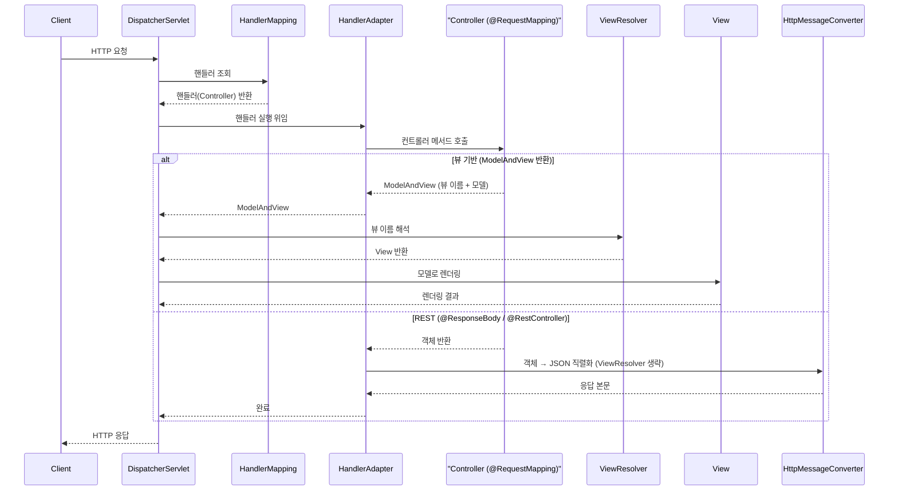

# Spring Framework 3.x (2009 ~)

> XML 없이 자바 코드(`@Configuration`/`@Bean`)만으로 컨테이너를 구성할 수 있게 된 시대. SpEL, REST, 환경/프로파일 추상화까지 더해 현대 Spring의 골격이 완성됐다.

## 릴리스 정보
- 최초 출시: 3.0 — 2009년 12월
- 주요 마이너 버전과 시기: 3.0(2009-12) → 3.1(2011-12) → 3.2(2012-12)
- 최소 자바 버전(baseline): Java 5 이상 (Spring 최초로 Java 5를 정식 요구, 제네릭·어노테이션 전면 활용)
- Java EE / Jakarta EE 기준: J2EE 1.4 / Java EE 5와 호환(일부 Java EE 6 기능 지원). 서블릿 컨테이너도 Tomcat 5.0 / Jetty 5.1 등 구버전과 호환.

## 시대적 배경
2.5의 컴포넌트 스캔과 스테레오타입(`@Component` 등)으로 **내가 작성한 빈은 XML 없이 등록**할 수 있게 됐다. 다만 서드파티 객체처럼 어노테이션을 붙일 수 없는 빈을 자바 코드만으로 "정의"하는 수단(`@Configuration`/`@Bean`)은 아직 없어, 이런 빈은 여전히 XML `<bean>`의 몫이었다. 한편 자바 진영에는 Guice(Google) 같은 순수 코드 기반 DI 컨테이너가 등장해 "타입 안전한 자바 설정"의 매력을 보여줬다. Java 5가 충분히 보급된 2009년, Spring 3.0은 코드베이스를 Java 5 기준으로 재정비하고 **JavaConfig**를 코어에 정식 편입했다. 이로써 "XML이냐 어노테이션이냐 자바냐"라는 세 가지 설정 스타일이 모두 갖춰졌다.

## 핵심 추가/변경 기능

### Java 기반 설정 (@Configuration / @Bean) — 3.x의 핵심
별도 프로젝트였던 JavaConfig가 코어로 들어오며, XML 한 줄 없이 자바 클래스로 컨테이너를 구성할 수 있게 됐다.

XML 방식 vs Java Config 방식 비교:

```xml
<!-- 기존 XML -->
<bean id="dataSource" class="...BasicDataSource" destroy-method="close">
    <property name="url"      value="jdbc:mysql://localhost/test"/>
    <property name="username" value="root"/>
</bean>
<bean id="accountService" class="com.example.AccountServiceImpl">
    <constructor-arg ref="accountDao"/>
</bean>
```

```java
// Spring 3.0 Java Config — 타입 안전, 리팩토링 친화적
@Configuration
public class AppConfig {

    @Bean(destroyMethod = "close")
    public DataSource dataSource() {
        BasicDataSource ds = new BasicDataSource();
        ds.setUrl("jdbc:mysql://localhost/test");
        ds.setUsername("root");
        return ds;
    }

    @Bean
    public AccountDao accountDao() {
        return new JdbcAccountDao(dataSource());
    }

    @Bean
    public AccountService accountService() {
        return new AccountServiceImpl(accountDao());
    }
}
```

```java
// 부트스트랩: XML이 아니라 클래스를 넘긴다
ApplicationContext ctx =
    new AnnotationConfigApplicationContext(AppConfig.class);
AccountService service = ctx.getBean(AccountService.class);
```

### SpEL (Spring Expression Language)
빈 정의·어노테이션 안에서 런타임 표현식을 평가하는 통합 표현 언어. 프로퍼티 조회, 메서드 호출, 컬렉션 조작 등이 가능하다.

```java
@Value("#{systemProperties['user.region'] ?: 'KR'}")
private String region;

@Value("#{ T(java.lang.Math).random() * 100 }")
private double seed;
```

### Spring MVC의 REST 지원
RESTful 웹 서비스를 1급으로 지원. `@PathVariable`, 콘텐츠 협상, `@ResponseBody`/`HttpMessageConverter`(JSON/XML 자동 변환), `RestTemplate`(클라이언트) 등이 추가됐다.

```java
@Controller
@RequestMapping("/accounts")
public class AccountRestController {

    @RequestMapping(value = "/{id}", method = RequestMethod.GET)
    @ResponseBody
    public Account get(@PathVariable("id") long id) {
        return accountService.find(id);   // JSON으로 직렬화되어 응답
    }
}
```

아래는 `DispatcherServlet`을 단일 진입점(Front Controller)으로 하는 Spring MVC 요청 처리 흐름이다. 디스패처가 HandlerMapping으로 핸들러를 찾고, **HandlerAdapter**를 통해 컨트롤러를 호출한다. 반환값이 뷰 기반(`ModelAndView`)이면 ViewResolver/View로 렌더링하고, REST(`@ResponseBody`/`@RestController`)면 ViewResolver를 거치지 않고 HttpMessageConverter가 본문을 직렬화한다.



### 선언적 비동기 / 스케줄링 (@Async, @Scheduled)
`@Async`로 메서드를 비동기 실행, `@Scheduled`로 주기 작업을 어노테이션만으로 등록.

```java
@Configuration
@EnableAsync
@EnableScheduling
public class TaskConfig { }

@Service
public class ReportService {

    @Async
    public Future<Report> generate() { /* 별도 스레드 실행 */ }

    @Scheduled(cron = "0 0 * * * *")
    public void hourlyCleanup() { /* 매시 정각 */ }
}
```

### 환경 추상화 / 프로파일 (@Profile) — 3.1
`Environment` 추상화와 `@Profile`로 개발/운영 등 환경별 빈 구성을 분리. 프로퍼티 소스도 통합 관리(`@PropertySource`).

```java
// 3.1의 @Profile은 @Target(TYPE) — 클래스(설정) 단위로만 붙일 수 있다.
// (@Bean 메서드 단위 @Profile은 Spring 4.0부터 가능)
@Configuration
@Profile("dev")
public class DevDataSourceConfig {

    @Bean
    public DataSource dataSource() {
        return new EmbeddedDatabaseBuilder().build();   // H2 등 임베디드
    }
}

@Configuration
@Profile("prod")
public class ProdDataSourceConfig {

    @Bean
    public DataSource dataSource() {
        return jndiDataSource();                          // 운영 DB
    }
}
```

### 캐시 추상화 (@Cacheable) — 3.1
백엔드(EhCache, ConcurrentMap 등)와 무관한 선언적 캐싱.

```java
@Service
public class BookService {
    @Cacheable("books")
    public Book findIsbn(String isbn) { /* 느린 조회 */ }
}
// @EnableCaching 으로 활성화
```

### c: 네임스페이스, @EnableXxx 모듈 활성화
- 3.1: 생성자 인자용 `c:` XML 네임스페이스 추가, `@Enable*` 스타일 모듈 활성화 어노테이션 정착.
- 3.0: 내장 검증(JSR-303 Bean Validation) 통합, OXM(Object/XML Mapping) 모듈.

## 설정 스타일의 변화
이 시대에 **세 가지 설정 스타일이 모두 완성**되어 공존하게 됐다.
1. XML — 전통 방식, `c:`/`p:` 네임스페이스로 더 간결해짐
2. 어노테이션 + 컴포넌트 스캔 — 2.5에서 도입, 계속 발전
3. **Java Config(`@Configuration`/`@Bean`)** — 3.0의 핵심. 타입 안전하고 IDE 리팩토링·디버깅에 강함

3.1의 `@Profile`/`@PropertySource`/`@Enable*`이 더해지며 "XML 0줄" 구성이 현실적으로 가능해졌고, 이것이 곧 Spring Boot(2014)의 토대가 된다.

## 마이너 버전별 변화
- 3.0 (2009-12): **Java 5 베이스라인**, `@Configuration`/`@Bean`(Java Config), SpEL, REST 지원(`@PathVariable` 등), `@Async`, OXM, JSR-303 검증 통합.
- 3.1 (2011-12): **환경/프로파일 추상화(`@Profile`)**, 캐시 추상화(`@Cacheable`/`@EnableCaching`), `@PropertySource`, `c:` 네임스페이스, Java 기반 MVC 설정(`@EnableWebMvc`), 서블릿 3.0 기반 `WebApplicationInitializer`(web.xml 없는 부트스트랩), Servlet 3.0 기반 파일 업로드(`StandardServletMultipartResolver`).
- 3.2 (2012-12): **Spring MVC 비동기 처리(`Callable`/`DeferredResult`)**, `@ControllerAdvice` 전역 예외 처리, MVC 테스트 프레임워크(`MockMvc`), `@MatrixVariable`·콘텐츠 협상 개선, Gradle 빌드 전환.

## 영향과 의의
- **Java Config의 도입**으로 "설정도 코드다"라는 인식이 확산됐고, XML 의존을 끊을 수 있는 길이 열렸다.
- REST 지원 강화로 Spring MVC가 웹 API 개발의 사실상 표준 도구로 자리 잡았다.
- `@Profile`·`@Enable*`·`@PropertySource`·`WebApplicationInitializer` 등 3.1/3.2의 자바 기반 부트스트랩 기능은 **Spring Boot의 자동 구성(auto-configuration) 철학으로 직접 이어진다.** 3.x가 없었다면 Boot도 없었다.

## 참고 출처
- [Spring Framework - Wikipedia](https://en.wikipedia.org/wiki/Spring_Framework)
- [Spring Framework 3.0: Releases, Release Date, EOL - versionlog](https://versionlog.com/spring-framework/3.0/)
- [Spring framework version history - codejava.net](https://www.codejava.net/frameworks/spring/spring-framework-version-history)
- [New Features and Enhancements in Spring Framework 4.0 (docs)](https://docs.spring.io/spring-framework/docs/4.2.x/spring-framework-reference/html/new-in-4.0.html)
- [Spring Framework Versions: Feature list by version](https://bluebirdinternational.com/spring-framework-versions/)
