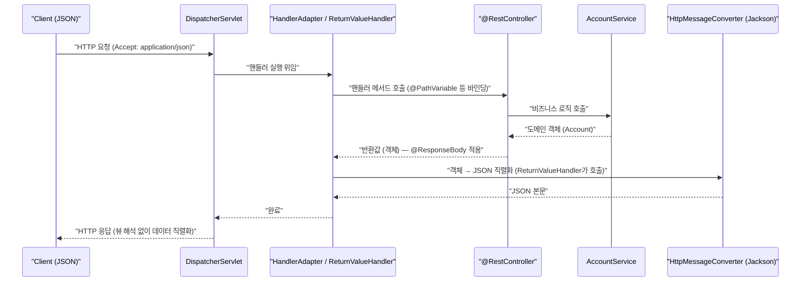

# Spring Framework 4.x (2013 ~)

> Java 8(람다·java.time)을 정식으로 받아들이고, `@RestController`·WebSocket·`@Conditional`을 도입한 세대. 같은 시기에 등장한 Spring Boot(2014)와 함께 "관례 우선" 시대를 연다.

## 릴리스 정보
- 최초 출시: 4.0 — 2013년 12월
- 주요 마이너 버전과 시기: 4.0(2013-12) → 4.1(2014-09) → 4.2(2015-07) → 4.3(2016-06)
- 최소 자바 버전(baseline): Java 6 이상(Java 7/8 권장). 4.0부터 Java 8 정식 지원, 4.3은 Java 6+/Servlet 2.5+ 요구의 마지막 세대.
- Java EE / Jakarta EE 기준: Java EE 6 기반(JPA 2.0, Servlet 3.0), Java EE 7 일부 지원(WebSocket·JMS 2.0 등)

## 시대적 배경
2014년 3월 Java 8이 출시되며 **람다 표현식·메서드 참조·`java.time`(JSR-310)·`Optional`**이라는 대형 언어 변화가 왔다. Spring 4.0은 이 변화에 맞춰 코드베이스를 정비하고 Java 8을 1급으로 지원했다. 동시에 낡은 의존성(Java 5, Servlet 2.4 등)에 대한 지원을 정리했다.

더 큰 사건은 **2014년 Spring Boot 1.0**의 등장이다. Boot는 4.x의 조건부 빈(`@Conditional`)·Java Config·`@Enable*` 기능 위에서 "자동 구성(auto-configuration)"과 "내장 톰캣"을 제공해, Spring 설정의 복잡함을 사실상 제거했다. 4.x는 Boot라는 거대한 생태계를 떠받치는 토대 세대다.

## 핵심 추가/변경 기능

### Java 8 1급 지원
람다/메서드 참조를 콜백 인터페이스에 직접 사용, `java.time` 타입을 컨버전·포매팅에서 지원, `Optional`을 컨트롤러 파라미터/주입에 활용.

```java
// JdbcTemplate에 람다로 RowMapper 전달 (Java 8)
List<Account> accounts = jdbcTemplate.query(
    "SELECT id, name FROM account",
    (rs, rowNum) -> new Account(rs.getLong("id"), rs.getString("name")));
```

```java
// java.time 지원
@DateTimeFormat(iso = ISO.DATE)
private LocalDate openDate;

// Optional 파라미터 (4.1+) — @GetMapping은 4.3부터이므로 4.1/4.2에서는 @RequestMapping을 쓴다
@RequestMapping(value = "/search", method = RequestMethod.GET)
public List<Account> search(@RequestParam Optional<String> keyword) { ... }
```

### @RestController
`@Controller` + `@ResponseBody`를 합친 합성 어노테이션. REST API 작성이 한층 간결해졌다.

```java
@RestController                       // 모든 메서드 반환값이 응답 본문(JSON)
@RequestMapping("/accounts")
public class AccountApi {

    @GetMapping("/{id}")              // 4.3의 @GetMapping과 결합하면 더 간결
    public Account get(@PathVariable long id) {
        return accountService.find(id);
    }
}
```

다음은 `@RestController`/`@ResponseBody`가 뷰를 거치지 않고 `HttpMessageConverter`(Jackson)로 객체↔JSON을 변환해 응답하는 흐름이다. 실제로는 `DispatcherServlet`이 직접 컨버터를 호출하지 않고, `RequestMappingHandlerAdapter`의 반환값 처리기(`RequestResponseBodyMethodProcessor`)가 컨버터를 사용한다.



`@RestController`는 `@Controller`+`@ResponseBody`의 합성이라 모든 반환값이 뷰가 아닌 응답 본문으로 처리되며, 요청 본문(JSON)도 같은 컨버터로 객체로 역직렬화된다.

### @Conditional — 조건부 빈 등록
환경/클래스패스/프로퍼티 등 조건에 따라 빈 등록 여부를 결정하는 일반화된 메커니즘. **Spring Boot 자동 구성의 핵심 엔진**(`@ConditionalOnClass`, `@ConditionalOnMissingBean` 등은 모두 이 위에 구현됨).

```java
@Configuration
public class CacheConfig {

    @Bean
    @Conditional(RedisAvailableCondition.class)
    public CacheManager redisCacheManager() { ... }
}
```

### WebSocket / SockJS / STOMP
`spring-websocket` 모듈로 표준 WebSocket(JSR-356)과 SockJS 폴백, STOMP 메시징을 지원. 실시간 양방향 통신을 위한 메시징 인프라(`spring-messaging`) 도입.

```java
// 4.x의 WebSocketMessageBrokerConfigurer 인터페이스에는 default 메서드가 없어
// 직접 구현하면 모든 추상 메서드를 구현해야 한다. 필요한 메서드만 재정의하려면
// AbstractWebSocketMessageBrokerConfigurer를 상속한다. (인터페이스 default화는 5.0부터)
@Configuration
@EnableWebSocketMessageBroker
public class WsConfig extends AbstractWebSocketMessageBrokerConfigurer {

    @Override
    public void registerStompEndpoints(StompEndpointRegistry registry) {
        registry.addEndpoint("/ws").withSockJS();
    }

    @Override
    public void configureMessageBroker(MessageBrokerRegistry registry) {
        registry.enableSimpleBroker("/topic");
        registry.setApplicationDestinationPrefixes("/app");
    }
}
```

### Groovy DSL 빈 정의
XML/Java Config 외에 Groovy DSL로 빈을 정의하는 방식 추가. XML과 동일 개념이지만 훨씬 간결하다.

```groovy
beans {
    dataSource(BasicDataSource) {
        url = 'jdbc:mysql://localhost/test'
        username = 'root'
    }
    accountService(AccountServiceImpl, ref('accountDao'))
}
```

### 기타
- **`@Repeatable`** 적용: `@PropertySource`, `@Scheduled` 등을 같은 요소에 반복 선언 가능(Java 8).
- 핵심 어노테이션의 메타 어노테이션화 → 합성 어노테이션 작성 용이.
- 4.1: 캐시 추상화 개선(`@CacheConfig`, JCache/JSR-107 지원), MVC `ResponseEntity`/`RequestEntity` 빌더, 정적 자원 처리 개선, 테스트의 SQL 스크립트(`@Sql`).
- 4.2: `@AliasFor`(어노테이션 속성 별칭), 어노테이션 기반 이벤트 리스너(`@EventListener`), CORS 지원, HTTP 스트리밍 개선.
- 4.3: **합성 매핑 어노테이션(`@GetMapping`/`@PostMapping`/`@PutMapping`/`@DeleteMapping`)**, 단일 생성자 시 `@Autowired` 생략 가능(암묵적 생성자 주입), `@RequestScope`/`@SessionScope`. Spring 4 시리즈의 마지막이자 장기 지원 버전.

## 설정 스타일의 변화
설정 스타일은 XML / 어노테이션 / Java Config / Groovy DSL 4종이 공존하되, **무게중심이 완전히 Java Config + 어노테이션으로 이동**했다. 결정적 변화는 외부에서 왔다 — **Spring Boot**가 4.x의 `@Conditional`·`@Enable*`·Java Config를 활용해 "설정을 거의 작성하지 않는" 자동 구성 모델을 제시하면서, 실무 표준이 "XML 작성"에서 "스타터 의존성 추가 + 프로퍼티 몇 줄"로 바뀌었다.

## 마이너 버전별 변화
- 4.0 (2013-12): **Java 8 지원(람다·`java.time`)**, `@RestController`, `@Conditional`, WebSocket/STOMP(`spring-websocket`, `spring-messaging`), Groovy DSL, Java EE 7 일부 지원.
- 4.1 (2014-09): JCache(JSR-107), `ResponseEntity`/`RequestEntity` 빌더, `@Sql` 테스트, MVC 뷰 해석 개선, WebSocket 개선, SpEL 컴파일러(compiler mode).
- 4.2 (2015-07): `@AliasFor`, `@EventListener`, 전역/메서드 CORS, HTTP 스트리밍.
- 4.3 (2016-06): `@GetMapping` 등 합성 매핑 어노테이션, 암묵적 생성자 주입, `@RequestScope`/`@SessionScope`. Java 6+/Servlet 2.5+ 지원의 마지막 세대(장기 지원).

## 영향과 의의
- Java 8을 정식 수용하며 함수형 스타일 코드를 Spring 전반에 끌어들였다.
- `@RestController`와 합성 매핑 어노테이션은 오늘날 REST API 코드의 표준 형태를 확정했다.
- **`@Conditional`은 Spring Boot 자동 구성의 기반 기술**로, 4.x는 사실상 "Boot 시대를 떠받친 프레임워크 세대"다. 이후 개발자 경험의 중심은 Framework 직접 설정에서 Boot 스타터로 옮겨간다.

## 참고 출처
- [Spring Framework - Wikipedia](https://en.wikipedia.org/wiki/Spring_Framework)
- [New Features and Enhancements in Spring Framework 4.0 (docs)](https://docs.spring.io/spring-framework/docs/4.2.x/spring-framework-reference/html/new-in-4.0.html)
- [Spring Framework 4.0.3 released - Java 8 support production-ready](https://spring.io/blog/2014/03/27/spring-framework-4-0-3-released-with-java-8-support-now-production-ready/)
- [Groovy Bean Configuration in Spring Framework 4](https://spring.io/blog/2014/03/03/groovy-bean-configuration-in-spring-framework-4/)
- [Spring framework version history - codejava.net](https://www.codejava.net/frameworks/spring/spring-framework-version-history)
