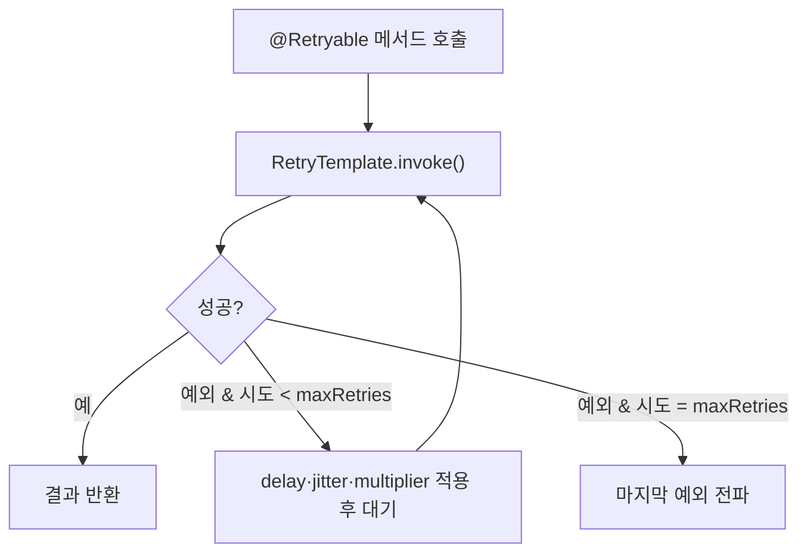

# Spring Framework 7.x (2025 ~)

> Java 17 baseline을 유지하면서 **Jakarta EE 11·JSpecify 널 안정성·코어 내장 회복성(resilience)·REST API 버저닝**을 받아들인 새 세대의 시작. Spring Boot 4.0의 토대가 되는 버전이다.

## 릴리스 정보
- 최초 출시: 7.0 GA — 2025년 11월 13일 (후속 7.0.1 — 2025년 11월 20일)
- 최소 자바 버전(baseline): **Java 17** (baseline 유지). 최신 LTS인 **Java 25를 권장**하며 최적화 — "Java 25 필수"가 아니라 17~25 범위 지원이다.
- Jakarta EE 기준: **Jakarta EE 11** (Jakarta Servlet 6.1, Jakarta Persistence 3.2, Jakarta Bean Validation 3.1, Jakarta WebSocket 2.2)
- 그 외 baseline: **Kotlin 2.2**, **GraalVM 25**, 테스트는 **JUnit 6.0** 기반
- 권장 런타임: Tomcat 11.0+ / Jetty 12.1+, Hibernate ORM 7.1+, Hibernate Validator 9.0+

## 시대적 배경

Spring Framework 6.0(2022)이 `javax.*` → `jakarta.*` 네임스페이스 전환과 AOT/네이티브 이미지의 토대를 놓은 세대였다면, 7.0은 그 위에서 생태계 표준에 맞춰 한 단계 더 정렬한 "새 세대의 시작"이다. 변화의 동인은 네 가지다.

1. **널 안정성의 생태계 표준 수렴** — Spring 5에서 도입한 독자 애노테이션(`org.springframework.lang`, JSR 305 의미론)을 업계 표준 **JSpecify**로 옮긴다. 타입 사용 위치(제네릭 인자·배열 요소)까지 정밀하게 nullability를 표현하고, Kotlin의 네이티브 널 안정성으로 자동 변환된다.
2. **회복성(resilience)의 코어 내장** — 그동안 Spring Retry 등 별도 프로젝트에 있던 재시도·동시성 제한을 `spring-context` 코어로 들였다.
3. **REST API 버저닝의 1급화** — 엔드포인트 버저닝을 매핑 애노테이션의 정식 속성으로 제공한다.
4. **최신 OSS 생태계 정렬** — Jakarta EE 11, Kotlin 2.2, GraalVM 25, Jackson 3을 끌어안고 Java 25 LTS에 최적화한다.

릴리스 정렬상 Spring Boot 3.5 / Spring Cloud 2025.0(2025-05)은 여전히 Framework 6.2 기반이고, **Spring Boot 4.0(2025-11)이 Framework 7.0 위에 빌드**된다.

## 핵심 추가/변경 기능

### JSpecify 기반 널 안정성 (org.springframework.lang → org.jspecify)
Spring 5의 `@Nullable`/`@NonNull`/`@NonNullApi`/`@NonNullFields`(`org.springframework.lang`)가 deprecated되고, 표준 스펙인 **JSpecify**(`org.jspecify.annotations`)로 대체된다. `@NullMarked`로 영역 전체 기본값을 non-null로 두고, null이 가능한 곳만 `@Nullable`로 표시한다.

```java
// package-info.java — 패키지 전체 기본을 non-null로
@NullMarked
package com.example.app;

import org.jspecify.annotations.NullMarked;
```

```java
public @Nullable String buildMessage(@Nullable String message,
                                     @Nullable Throwable cause) {
    // ...
}
```

JSpecify는 `@Target(TYPE_USE)`라 제네릭 타입 인자·배열 요소·varargs의 nullability까지 정밀하게 지정할 수 있다.

```java
@Nullable Object[] array              // 요소 nullable, 배열 자체는 non-null
Object @Nullable [] array             // 요소 non-null, 배열 자체 nullable
List<@Nullable String> list           // 제네릭 인자의 nullability
```

### 코어 내장 회복성 — @Retryable · @ConcurrencyLimit
재시도와 동시성 제한이 `spring-context`에 내장됐다. `@EnableResilientMethods`로 활성화하고, 선언적으로 `@Retryable`·`@ConcurrencyLimit`를, 프로그래밍 방식으로 `RetryTemplate` + `RetryPolicy`를 쓴다.

```java
@Configuration
@EnableResilientMethods
public class ResilienceConfig { }
```

```java
// 선언적 재시도 — 지수 백오프 + jitter
@Retryable(
    includes = MessageDeliveryException.class,
    maxRetries = 4,
    delay = 100,
    jitter = 10,
    multiplier = 2,
    maxDelay = 1000)
public void sendNotification() {
    this.jmsClient.destination("notifications").send(payload);
}
```

```java
// 동시 호출 수 제한 — 가상 스레드 환경에서 특히 유용
@ConcurrencyLimit(10)   // 동시 10개로 제한 (value=1이면 인스턴스 단위 직렬화)
public void heavyTask() { /* ... */ }
```

```java
// 프로그래밍 방식 (GA 레퍼런스 기준 — maxRetries / invoke)
var retryPolicy = RetryPolicy.builder()
    .includes(MessageDeliveryException.class)
    .maxRetries(4)
    .delay(Duration.ofMillis(100))
    .build();

var retryTemplate = new RetryTemplate(retryPolicy);
retryTemplate.invoke(() -> jmsClient.destination("notifications").send(payload));
```

> 참고: RC 이전 초기 블로그는 `maxAttempts`/`execute()` 표기를 썼으나, GA 공식 레퍼런스는 `maxRetries`/`invoke()`가 정본이다. 기본값은 maxRetries=3(총 4회 시도)·delay 1초.

`Mono`/`Flux` 같은 리액티브 반환 타입은 Reactor의 retry 기능으로 파이프라인이 자동 데코레이트된다.

아래 흐름도는 `@Retryable` 메서드 호출이 `RetryPolicy`에 따라 재시도되는 경로를 보여준다.



### REST API 버저닝 (version 속성)
`@RequestMapping` 계열(`@GetMapping` 등)에 `version` 속성이 생겼다. 버전 해석 전략(헤더·쿼리 파라미터·경로 세그먼트·미디어 타입)은 `ApiVersionConfigurer`로 구성한다. Spring MVC와 WebFlux 양쪽을 지원한다.

```java
@Configuration
public class WebConfig implements WebMvcConfigurer {
    @Override
    public void configureApiVersioning(ApiVersionConfigurer configurer) {
        configurer.useRequestHeader("API-Version");
    }
}
```

```java
@RestController
public class AccountController {
    @GetMapping(path = "/account/{id}", version = "1.1")   // 버전별 매핑
    public Account getAccount(@PathVariable Long id) { /* ... */ }
}
```

```java
// 클라이언트 측 — RestClient가 버전 헤더를 자동 삽입
RestClient client = RestClient.builder()
    .baseUrl("http://localhost:8080")
    .apiVersionInserter(ApiVersionInserter.useHeader("API-Version"))
    .build();

Account account = client.get().uri("/account/1")
    .apiVersion(1.1)
    .retrieve()
    .body(Account.class);
```

요청 버전은 `major.minor.patch` 시맨틱 버전으로 파싱되며, `"1.2+"` 같은 baseline 버전(해당 핸들러가 그 이후 버전까지 커버)도 지원한다.

### Jackson 3 기본 지원
전체 스택이 **Jackson 3.x**를 기본으로 쓰고 Jackson 2.x로 폴백할 수 있다. Jackson 3은 패키지가 `tools.jackson`으로 바뀌었다(애노테이션 클래스 `com.fasterxml.jackson.annotation`은 잔존). 직렬화 커스터마이저·`ObjectMapper` 설정 코드가 영향을 받는다.

## 그 외 변경
- **신규 클라이언트/테스트 지원**: `JmsClient`(JMS 플루언트 API), `RestTestClient`, HTTP Interface Client(`@HttpExchange`) 설정 개선, 프로그래밍 방식 빈 등록(programmatic bean registration).
- **GraalVM 25 / AOT 개선**: 리소스 힌트가 정규식에서 glob 패턴으로 전환됐고, 타입에 reflection 힌트를 등록하면 메서드·생성자·필드 introspection이 자동 함의된다.
- **제거·변경**: `ListenableFuture`·`Theme` 지원·Undertow 전용 클래스 제거, `HttpHeaders`가 더 이상 `MultiValueMap`을 상속하지 않음, SpEL 식에 기본 10,000 연산 한도(DoS 방어) 적용.
- **`javax.annotation`·`javax.inject` 애노테이션 지원 완전 제거** → `jakarta.annotation.*`·`jakarta.inject.*`로 전환 필수(6.x가 남겨둔 잔여 `javax.*`를 마저 정리).

## 마이그레이션 관점 (6.x → 7.0)
- **Jakarta EE 9/10 → 11**: Servlet 6.1·JPA 3.2·Bean Validation 3.1로 상향, Tomcat 11+·Hibernate ORM 7.1+·Validator 9+ 등 런타임 의존성 대거 상향.
- **널 안정성 애노테이션 교체**: `org.springframework.lang.*` → `org.jspecify.annotations.*`.
- **Jackson 3 전환**: `tools.jackson` 패키지 변경 대응.
- **잔여 `javax.*` 제거**: `javax.annotation`/`javax.inject` → `jakarta.*`.
- **API 시그니처 변경**: `HttpHeaders`의 `MultiValueMap` 비상속, `ListenableFuture`/`Theme`/Undertow 제거 등.
- 전반 기조는 파괴적 변경보다 **관리된 deprecation을 통한 부드러운 업그레이드 경로**다.

## 영향과 의의
- **널 안정성의 표준화**: 독자 애노테이션에서 JSpecify로 수렴하며, Kotlin과의 널 안정성 통합이 한층 매끄러워졌다.
- **회복성의 1급화**: 재시도·동시성 제한을 외부 라이브러리 없이 코어에서 선언적으로 다룰 수 있게 됐다(가상 스레드 환경의 `@ConcurrencyLimit`가 대표적).
- **REST 진화 대응**: API 버저닝이 프레임워크 기능으로 들어오며, 버전 공존·점진적 폐기를 표준 방식으로 다룬다.
- Spring Boot 4.0이 이 위에 빌드되어, 자동 설정·모듈화와 함께 새 세대의 기준선을 형성한다.

## 참고 출처
- [Spring Framework 7.0 General Availability (spring.io blog)](https://spring.io/blog/2025/11/13/spring-framework-7-0-general-availability/)
- [Spring Framework 7.0 Release Notes (GitHub wiki)](https://github.com/spring-projects/spring-framework/wiki/Spring-Framework-7.0-Release-Notes)
- [From Spring Framework 6.2 to 7.0 (spring.io blog)](https://spring.io/blog/2024/10/01/from-spring-framework-6-2-to-7-0/)
- [Core Spring Resilience Features (spring.io blog)](https://spring.io/blog/2025/09/09/core-spring-resilience-features/)
- [Resilience (Spring Framework Reference)](https://docs.spring.io/spring-framework/reference/core/resilience.html)
- [API Versioning in Spring (spring.io blog)](https://spring.io/blog/2025/09/16/api-versioning-in-spring/)
- [Null-safety (Spring Framework Reference)](https://docs.spring.io/spring-framework/reference/core/null-safety.html)
